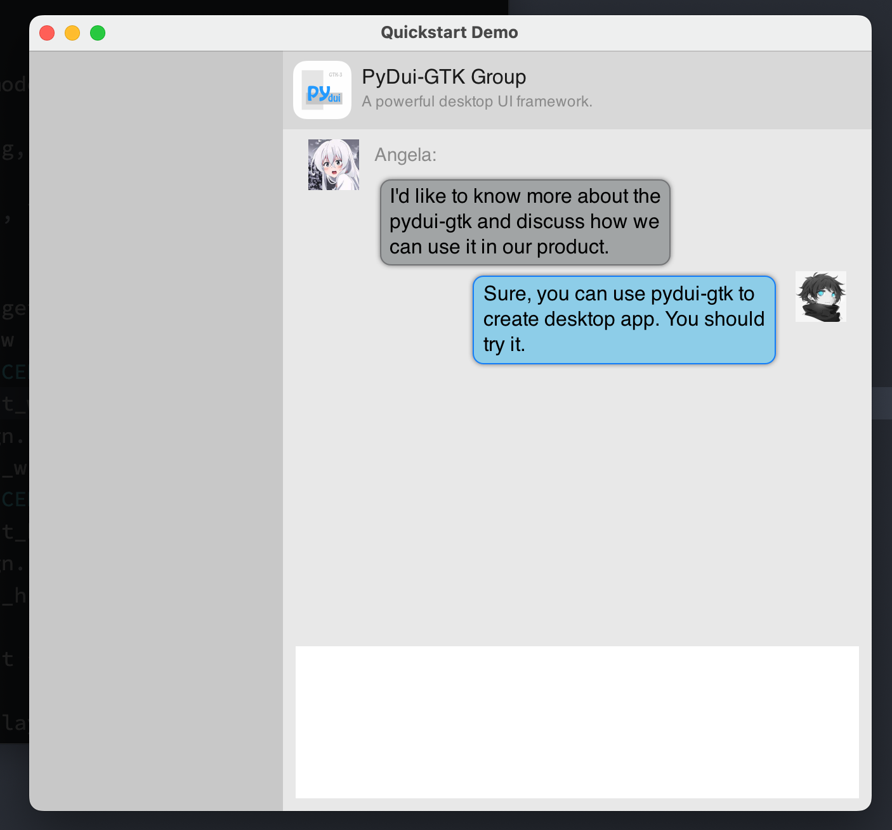
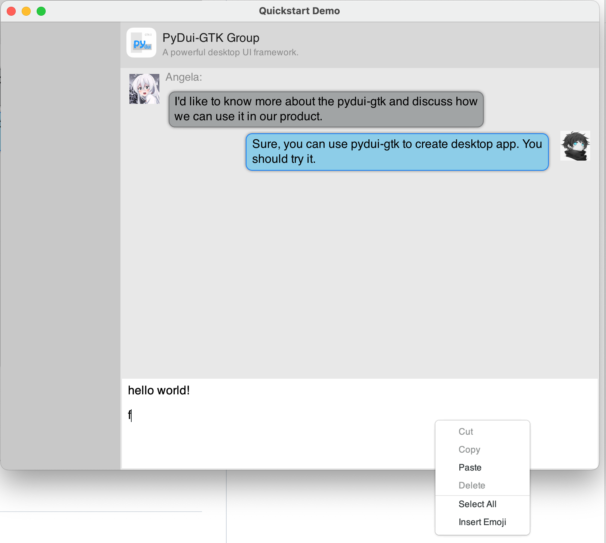

PyDui Documentation
===================

[](https://dzhsurf.github.io/pydui/)


## Introduction

**PyDui base on GTK-3, PyGObject**

PyDui is based on PyGObject/GTK-3, but totally runs on self-drawing canvas. Because GTK-3 widgets are not easy to understand how it works. We are tent to provide an easy API to help developers to build UI applications more quickly and efficiently, putting more focus on the product either than the details of the framework.


Why choose GTK, not QT or any other framework as the low-level module?
As GTK is a powerful cross-platform framework, it can run on Windows, MacOSX, and Linux well, and it's light enough, fewer dependencies mean it can be easy to pack and deploy.


And why use self-drawing instead of GTK's widget pattern?
Even though there is GTK/Glade can quickly build a powerful UI Application. But the Glade is not easy enough to learn. Especially the layout design pattern on GTK is terrible hell for developers and designers.


Sometimes, we need another solution for rapidly building a simple app. I think, on the windows platform, DuiLib is an option because it's easy to learn. That is the reason we use self-drawing to reimplement all the virtual widgets.


**Why not just wrap the DuiLib API ?** 

This is a good question because DuiLib only works on windows. And the author work on mac. So, this is not for cross-platform purposes, just personal reasons.


## Install

`PyDui require python >= 3.9`

Even though it's easy to downgrade the python version, personal reasons, the author DO NOT WANT TO KEEP ALL THE VERSION WORK!

```shell
pip install pydui-gtk
```

**Windows:** see the prerequisites below, you must setup the gtk development environment first to build the gtklib on the windows platform.


## Building

**Prerequisites**

miniconda: https://conda.io/projects/conda/en/latest/user-guide/install/index.html

> If you are already in python3.9 environment, conda is not needed. but we highly recommend using it to manage the dev env.

**Windows:** 

* Build Tools: For Windows platform, Microsoft Visual C++ 14.0 or greater is required. Get it with "Microsoft C++ Build Tools": https://visualstudio.microsoft.com/visual-cpp-build-tools/
* Install gtk environment
* Use the precompiled binary files or you can build by yourself. Browser the link below. I provided the precompiled files and the building guide.
  * https://github.com/dzhsurf/gtk3-precompiled-libs-win-vs2019 
* poetry: https://python-poetry.org/docs/


**MacOSX:** 

> No extra dependencies needed.


**Linux:** ...

> ... 


**Setup and build**

```shell
# first, checkout the code
# git clone ...
# second, use conda setup environment 
conda env create -f conda_env.yaml
conda activate pydui
# local install 
pip install -e .
```


## Code Example

 

```python
import pydui
from pydui import *
from pydui.core.resource_loader import create_default_resource_loader

# config builder here
def get_builder() -> PyDuiBuilder:
    builder = PyDuiBuilder()
    builder.register_resource_loader(create_default_resource_loader())
    return builder

# custom window handler
class DemoHandler(PyDuiWindowHandler):
    def on_window_init(self, window: PyDuiWindow):
        print(f"on_window_init")
        #def handle_click(object):
        #    print("You clicked!", object)   
        # bind widget event here
        #widget = window.get_widget(widget_id="button")
        #widget.connect("clicked", handle_click)

    def on_window_destroy(self):
        print(f"on_window_destroy")
        PyDuiApplication.main_quit()


def main():
    print(f"start pydui version: {pydui.__version__}")

    window = get_builder().build_window(path="res/main.xml", handler=DemoHandler)
    window.show()

    PyDuiApplication.main_run()

if __name__ == "__main__":
    main()
```

XML File

```xml
<?xml version="1.0" encoding="utf-8"?>
<Window size="664,600" title='Quickstart Demo' min_size="600,400"
    default_font="Helvetica" default_fontsize="16">
    <HLayout bkcolor="#FFFFFFFF">
        <!-- left panel -->
        <VLayout bkcolor="#FFC8C8C8" width="200">
        </VLayout>
        <VLayout halign="CENTER" bkcolor="#FFE8E8E8">
            <!-- head -->
            <HLayout height="62" bkcolor="FFD8D8D8">
                <Picture width="46" image="res/images/logo.png" margin="8,8,8,8" />
                <VLayout margin="0,12,0,12">
                    <Label text="PyDui-GTK Group" halign="START" fontcolor="#FF1A1A1A" />
                    <Label text="A powerful desktop UI framework." fontsize="12" halign="START" fontcolor="#FF8A8A8A" />
                </VLayout>
            </HLayout>
            <!-- body -->
            <VLayout padding="8,8,8,8">

                <HLayout valign="START" margin="12,0,12,0" autofit="true" fitrule="h">
                    <Picture width="40" height="40" image="res/images/avatar-2.jpeg" />
                    <VLayout halign="START" margin="12,0,122,0" autofit="true" fitrule="h" >
                        <Label text="Angela:" autofit="true"
                            fontsize="14" fontcolor="#FF8A8A8A" valign="START" halign="START" />
                        <Label text="I'd like to know more about the pydui-gtk and discuss how we can use it in our product." margin="0,8,0,0"
                            autofit="true" autofit_padding="12,8,12,8"
                            corner="12,12,12,12"
                            bkimage="res/images/common_button_disable.png"
                        />
                    </VLayout>
                </HLayout>

                <HLayout valign="START" margin="12,0,12,0" autofit="true" fitrule="h">
                    <Control />
                    <Label text="Sure, you can use pydui-gtk to create desktop app. You should try it."
                        margin="122,0,12,0"
                        autofit="true" autofit_padding="12,8,12,8"
                        corner="12,12,12,12"
                        bkimage="res/images/common_button_normal.png"
                    />
                    <Picture width="40" height="40" image="res/images/avatar-1.jpeg" />
                </HLayout>

                <!-- bottom bar -->
                <Control />
                <Edit name="input_edit" bkcolor="#FFFFFFFF" height="120" margin="2,2,2,2" />
            </VLayout>
        </VLayout>
    </HLayout>
</Window>
```


## Support YogaLayout

Congratulations! Now you can use YogaLayout in PyDui-GTK!!!

More details about YogaLayout: https://yogalayout.com/docs/

Base on YogaLayout Python binding library - Poga. https://github.com/dzhsurf/poga

```xml
<?xml version="1.0" encoding="utf-8"?>
<Window size="800,600" title='Quickstart Demo' min_size="600,400"
    default_font="Helvetica" default_fontsize="16">
    <PGLayout
        bkcolor="#FFEFEFEF"
        align_content="stretch"
        align_items="stretch"
        flex_direction="row"
        flex_wrap="nowrap"
    >
        <!-- left -->
        <PGLayout bkcolor="#FFC8C8C8"
            width_percent="20"
            flex_grow="0"
        >
        </PGLayout>

        <!-- right -->
        <PGLayout bkcolor="#FFE8E8E8"
            width_percent="80"
            flex_direction="column"
            align_content="stretch"
            align_items="stretch"
            flex_wrap="nowrap"
        >
            <!-- head: Use PGLayout -->
            <PGLayout bkcolor="FFD8D8D8"
                flex_direction="row"
                height="62"
            >
                <Picture width="40" height="40" image="res/images/logo.png" margin="8,8,8,8" />
                <PGLayout margin="0,12"
                    flex_direction="column"
                    flex_grow="0" >
                    <Label text="PyDui-GTK Group" autofit="true" halign="start" fontcolor="#FF1A1A1A" />
                    <Label text="A powerful desktop UI framework." autofit="true" fontsize="12" halign="start" fontcolor="#FF8A8A8A" />
                </PGLayout>
            </PGLayout>

            <!-- body area: Use PGLayout -->
            <PGLayout
                flex_direction="column"
                flex_grow="1"
                align_content="stretch"
                align_items="stretch"
            >
                <!-- Item use HLayout in PGLayout -->
                <HLayout valign="start" margin="12,0,12,0" autofit="true" fitrule="h">
                    <Picture width="40" height="40" image="res/images/avatar-2.jpeg" margin="0,8,0,8" />
                    <VLayout halign="start" margin="8,0,122,0" autofit="true" fitrule="h" >
                        <Label text="Angela:" autofit="true"
                            fontsize="14" fontcolor="#FF8A8A8A" valign="start" halign="start" />
                        <Label text="I'd like to know more about the pydui-gtk and discuss how we can use it in our product." margin="0,8,0,0"
                            autofit="true" autofit_padding="12,8,12,8"
                            corner="12,12,12,12"
                            bkimage="res/images/common_button_disable.png"
                        />
                    </VLayout>
                </HLayout>

                <HLayout valign="start" margin="12,0,12,0" autofit="true" fitrule="h">
                    <Control />
                    <Label text="Sure, you can use pydui-gtk to create desktop app. You should try it."
                        margin="122,0,12,0"
                        autofit="true" autofit_padding="12,8,12,8"
                        corner="12,12,12,12"
                        bkimage="res/images/common_button_normal.png"
                    />
                    <Picture width="40" height="40" image="res/images/avatar-1.jpeg" />
                </HLayout>

                <PGLayout flex_grow="1" >
                </PGLayout>

                <!-- bottom bar -->
                <Edit name="input_edit" bkcolor="#FFFFFFFF" height="120" margin="2,2,2,2" />
            </PGLayout>
        </PGLayout>
    </PGLayout>
</Window>
```



## Internal Layout Engine

>  TODO: 
> ...

Maybe it will be deprecated in the future.


## Development

In the early stage, performance optimization, resource leakage issue, text rendering quality, and correctness issue are not the primary tasks. The first task is to complete the essential module function.

* Core
  * Builder, Render, ResourceLoader, EventDispatcher
* Layout
  * HLayout, VLayout, FixedLayout 
* Widgets
  * Label, Button, Picture, Edit, InfiniteList, Menu, Toast
* Deployment
  * Resource packer
  * Application builder
* Special Features
  * Text selection
  * Drag&Drop
  * Model Window
  * Intl
  * RichText
  * Window Shadow


## Planning: Web Platform Support

In the future, I want to add Web platform support on pydui. It is technically possible. Use js-worker to run python code in the browser background thread to handle the framework logic. Such as use  pyodide(https://pyodide.org/en/stable/usage/quickstart.html) . Implement the text measure functions RenderAPIs on the web platform instead of cairo on the desktop. Implement yoga-js builder for building the UI from the layout code.


## Development progress

There's much work to do...

Builder:

* [ Window, Control, Label, Button, Edit, Picture, HLayout, VLayout, PGLayout ] - finish
* StyleManager - planning

ResourceLoader:

* DefaultResourceLoader - finish
* FileResourceLoader - pending
* ResourceLoaderCache - pending
  * lrucache
* ArchiverResourceLoader - planning

Render:

* DrawRectangle - finish
* DrawImage - finish
* DrawText - finish
* Hi-DPI support - almost done
* Draw area boundary protection - 0%, processing

Layout:

* HLayout - finish
* VLayout - finish
* FixedLayout - 0%
* PGLayout - 70%
  * import YogaLayout Engine - 90% - base on poga project.
  * Layout implement

Widget:

* Widget base - finish
* Label - finish
* Button - finish
* Edit - 0%, processing
  * Focus event suppose
  * Key Event
  * Text selection
  * Drag&Drop
* Picture - 0%, processing
* Scrollable - 0%, pending
* InfiniteList - 0%, pending
* Menu - 0%, not started


## Benchmarks

> TODO
>
> ...


## Testing

> TODO
>
> ...


## Reference

YogaLayout: https://yogalayout.com/docs

Python Gtk-3 Tutorial: https://python-gtk-3-tutorial.readthedocs.io/en/latest/index.html

Python Gtk-3: https://lazka.github.io/pgi-docs/Gtk-3.0/index.html

Python Gdk-3: https://lazka.github.io/pgi-docs/Gdk-3.0/index.html

Python GdkPixbuf: https://lazka.github.io/pgi-docs/GdkPixbuf-2.0/index.html

Python Pango: https://lazka.github.io/pgi-docs/Pango-1.0/index.html

Pycairo: https://pycairo.readthedocs.io/en/latest/index.html

PyGObject: https://pygobject.readthedocs.io/en/latest/index.html

Python PangoCairo: https://lazka.github.io/pgi-docs/PangoCairo-1.0/index.html

---

Gtk-3: https://docs.gtk.org/gtk3/index.html

Pango: https://docs.gtk.org/Pango/index.html

GdkPixbuf: https://docs.gtk.org/gdk-pixbuf/index.html

PangoCairo: https://docs.gtk.org/PangoCairo/

---

Gtk pgi Symbol Mapping: https://lazka.github.io/pgi-docs/Gtk-3.0/mapping.html

Gdk pgi Symbol Mapping: https://lazka.github.io/pgi-docs/Gdk-3.0/mapping.html

